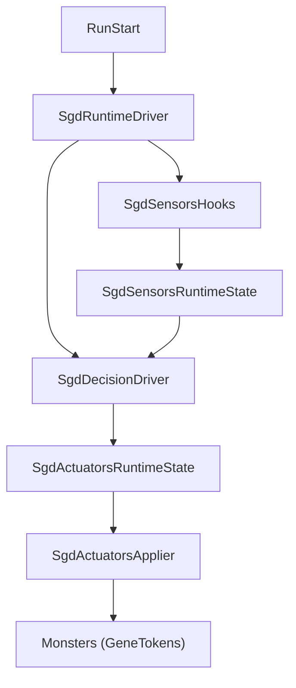
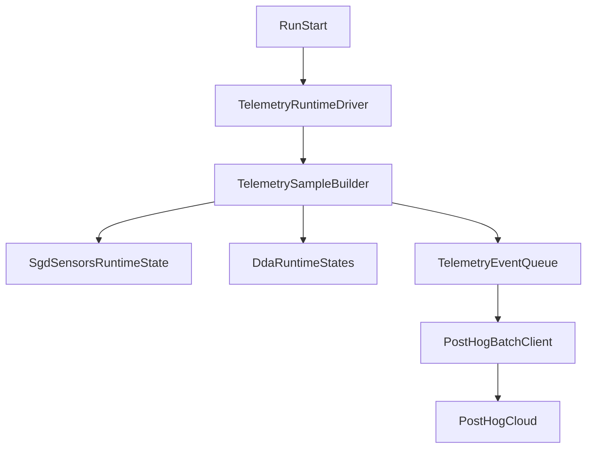
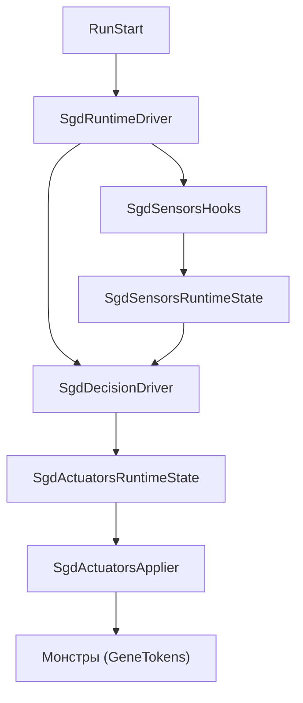

**Languages:** [English](#english) · [Русский](#russian)

---

## SGD DDA architecture

The SGD DDA implementation lives in `SgdEngine/` and follows **Sensors → Decision → Actuators → RoR2 world**. The active DDA mode (fixed, genetic, or SGD) is selected via `DdaAlgorithmState.ActiveAlgorithm`.

The **four difficulty axes** (monster `GeneStat` multipliers) are the core adaptation model: \(\theta = \ln m\), normalized lever position `challenge01`, `skill01` from sensors, and a separate SGD per axis. A readable spec without diving into code is in [`Axes.md`](Axes.md#english).

### Runtime driver

`SgdEngine/SgdRuntimeDriver.cs` hooks `Run.Start`: once per run it adds a component to `Run`, finds the player body, updates smoothed virtual power `SgdVirtualPowerEstimator` → `SgdRuntimeState`, calls `SgdSensorsHooks.Tick` every frame, and — on the server with SGD active — `SgdDecisionDriver.Tick`.

### Sensors

`SgdEngine/Sensors/SgdSensorsHooks.cs` subscribes to `HealthComponent.TakeDamage` and `CharacterBody.OnDestroy`: incoming/outgoing damage, player and monster deaths (TTK, death windows). Metrics are estimated in `SgdSensorsEstimator`; the latest sample is in `SgdSensorsRuntimeState`. Sensors can run under other DDA modes when overlay or comparable telemetry is needed.

### Decision (SGD)

`SgdEngine/Decision/SgdDecisionDriver.cs` on the server, when `DdaAlgorithmType.Sgd`, checks combat, sample availability, accumulates **combat seconds**, and performs discrete steps (`dueSteps`). Each step runs `StepAllAxes` on the latest `SgdSensorsSample`. \(\theta\), momentum, and step stats live in `SgdDecisionRuntimeState`. Multiplier ranges are aligned with actuators via `SgdAxisLimitProvider` and `ConfigManager` (`sgd*Floor` / `sgd*Cap`, see [`Axes.md`](Axes.md#english)).

### Actuators

`SgdEngine/Actuators/SgdActuatorsHooks.cs` on `CharacterBody.Start` for monsters with inventory applies current multipliers through `SgdGeneStatTokenApplier` to the four `GeneStat` values and calls `RecalculateStats`. Global values: `SgdActuatorsRuntimeState`; mass update of already-spawned enemies after an SGD step: `SgdActuatorsApplier.ApplyToAllLivingMonsters()`.

### Data flow

Sensors update every frame when data collection is needed. SGD decisions are discretized by accumulated combat time. Actuators refresh both newly spawned and existing monsters when multipliers change meaningfully.

### External RoR2 types

`Run`, `CharacterBody`, `HealthComponent`, `TeamIndex`, `RunArtifactManager`, `NetworkServer` — adaptation runs on the server only. SGD does **not** modify `GeneticEngine/`; the shared surface is `GeneStat` and tokens via `SgdGeneStatTokenApplier` (see [`RULE.md`](../../RULE.md#english)).

### Telemetry (PostHog)

The `Telemetry/` module does not control difficulty; it reads `SgdSensorsRuntimeState`, `SgdRuntimeState` (\(V_p\)), `SgdDecisionRuntimeState`, `SgdActuatorsRuntimeState`, optional GA-averaged multipliers, and mode from `DdaAlgorithmState.GetTelemetryMode()`.

Events are sent to PostHog via `/batch/`; schema version is `telemetry_schema_version` (docs refer to v2 and v3). Main event names: `dda_session_start`, `dda_sample` (sensors, per-axis `challenge01 - skill01` errors, multipliers, \(V_p\) and aggregate `virtual_challenge_total`), degradation/recovery episodes, player death, H5/H6 survey, `dda_session_end`.

For H1–H2, fields like `axis_*_skill01`, `axis_*_challenge01`, `axis_*_abs_error`, `axis_*_multiplier`, deltas, and `axis_*_is_jump` matter. For H3, reports rely on per-plane errors; `virtual_power_total` / `virtual_challenge_total` are auxiliary — see [`ToolsAndDebug.md`](ToolsAndDebug.md#english). PostHog host/token are injected at build time (`TelemetrySecrets.props`), not via BepInEx. User-facing config retains items such as **Research Telemetry / Telemetry Enabled** and sample/flush intervals.

### Post-run survey (H5/H6)

`TelemetrySurveyWidget` appears after death, run end, or quit if the survey was not sent; two Likert 1–7 scales, RU/EN locale; event `dda_post_session_survey` duplicated in `dda_session_end`.

---

## Архитектура SGD DDA

Алгоритм SGD DDA живёт в модуле `SgdEngine/` и следует цепочке **Sensors → Decision → Actuators → мир RoR2**. Активный режим DDA (фиксированный, генетический или SGD) выбирается через `DdaAlgorithmState.ActiveAlgorithm`.

**Четыре оси сложности** (множители `GeneStat` для монстров) — центральная модель адаптации: параметр \(\theta = \ln m\), нормализованная «вкрученность» `challenge01`, оценка `skill01` из сенсоров и отдельный SGD по каждой оси. Полное описание без чтения кода — в [`Axes.md`](Axes.md#russian).

### Runtime-драйвер

`SgdEngine/SgdRuntimeDriver.cs` вешается на `Run.Start`: один раз за забег добавляет компонент на объект `Run`, находит тело игрока, обновляет сглаженную виртуальную мощность `SgdVirtualPowerEstimator` → `SgdRuntimeState`, каждый кадр вызывает `SgdSensorsHooks.Tick`, а при активном SGD на сервере — `SgdDecisionDriver.Tick`.

### Сенсоры

`SgdEngine/Sensors/SgdSensorsHooks.cs` подписан на `HealthComponent.TakeDamage` и `CharacterBody.OnDestroy`: входящий и исходящий урон, смерти игрока и монстров (TTK, окна смертей). Оценка метрик — `SgdSensorsEstimator`, последний кадр — `SgdSensorsRuntimeState`. Сенсоры крутятся и при других режимах DDA, если нужен overlay или сопоставимая телеметрия.

### Решение (SGD)

`SgdEngine/Decision/SgdDecisionDriver.cs` на сервере и при `DdaAlgorithmType.Sgd` проверяет бой, наличие сэмпла, копит «секунды боя» и делает дискретные шаги (`dueSteps`). Каждый шаг — `StepAllAxes` по последнему `SgdSensorsSample`. Состояние \(\theta\), momentum и статистика шагов — `SgdDecisionRuntimeState`. Диапазоны множителей согласованы с актуаторами через `SgdAxisLimitProvider` и опции `ConfigManager` (`sgd*Floor` / `sgd*Cap`, см. [`Axes.md`](Axes.md#russian)).

### Актуаторы

`SgdEngine/Actuators/SgdActuatorsHooks.cs` на `CharacterBody.Start` для монстров с инвентарём применяет текущие множители через `SgdGeneStatTokenApplier` к четырём `GeneStat` и вызывает `RecalculateStats`. Глобальные значения — `SgdActuatorsRuntimeState`; массовое обновление уже живых врагов после шага SGD — `SgdActuatorsApplier.ApplyToAllLivingMonsters()`.

### Поток данных

Сенсоры обновляются каждый кадр (при необходимости сбора данных). Решение SGD дискретизовано по накопленному времени боя. Актуаторы обновляют и новых, и уже заспавненных монстров при заметном изменении множителей.

### Внешние типы RoR2

Используются `Run`, `CharacterBody`, `HealthComponent`, `TeamIndex`, `RunArtifactManager`, `NetworkServer` — адаптация выполняется только на сервере. SGD **не меняет** `GeneticEngine/`; общая точка — `GeneStat` и токены через `SgdGeneStatTokenApplier` (см. [`RULE.md`](../../RULE.md#russian)).

### Телеметрия (PostHog)

Модуль `Telemetry/` не управляет сложностью; он читает `SgdSensorsRuntimeState`, `SgdRuntimeState` (\(V_p\)), `SgdDecisionRuntimeState`, `SgdActuatorsRuntimeState`, при необходимости усреднённые множители GA, режим из `DdaAlgorithmState.GetTelemetryMode()`.

События уходят в PostHog через `/batch/`; версия схемы — поле `telemetry_schema_version` (в текстах ниже встречаются v2 и v3). Основные имена: `dda_session_start`, `dda_sample` (сенсоры, ошибки по осям `challenge01 - skill01`, множители, \(V_p\) и агрегат `virtual_challenge_total`), эпизоды деградации/восстановления, смерть игрока, опрос H5/H6, `dda_session_end`.

Для гипотез H1–H2 по осям важны поля вида `axis_*_skill01`, `axis_*_challenge01`, `axis_*_abs_error`, `axis_*_multiplier`, приращения и `axis_*_is_jump`. Для H3 в отчётах опираются на покомпонентные ошибки по четырём плоскостям; агрегаты `virtual_power_total` / `virtual_challenge_total` — вспомогательные, см. [`ToolsAndDebug.md`](ToolsAndDebug.md#russian). Host и токен PostHog задаются при сборке (`TelemetrySecrets.props`), не через BepInEx. В конфиге остаются пользовательские параметры вроде **Research Telemetry / Telemetry Enabled** и интервалы сэмпла/флеша.

### Post-run survey (H5/H6)

Виджет `TelemetrySurveyWidget` показывается после смерти, конца забега или выхода, если ответ ещё не отправлен; две шкалы Likert 1–7, локализация RU/EN; событие `dda_post_session_survey` и дублирование в `dda_session_end`.
