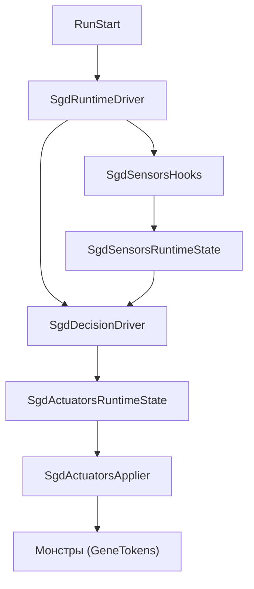
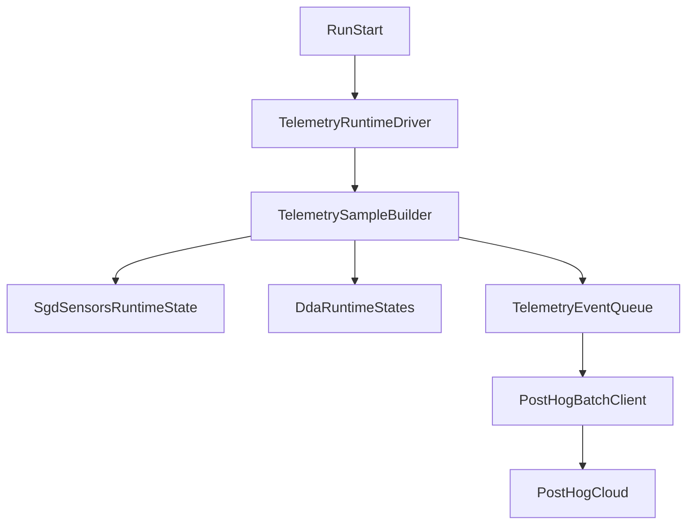

## Архитектура SGD DDA

Алгоритм SGD DDA реализован как отдельный модуль `SgdEngine/` и следует схеме:

**Sensors → Decision → Actuators → Мир RoR2**

При этом выбор активного алгоритма (фиксированный / генетический / SGD) контролируется через `DdaAlgorithmState.ActiveAlgorithm`.

### Основные подсистемы

- **Runtime‑драйвер**
  - `SgdEngine/SgdRuntimeDriver.cs`
  - Регистрируется на событие `Run.Start`.
  - Один раз за забег добавляет компонент `SgdRuntimeDriver` на объект `Run`.
  - Каждый кадр:
    - находит подходящее `CharacterBody` игрока;
    - обновляет виртуальную мощность игрока `SgdRuntimeState` на основе `SgdVirtualPowerEstimator`;
    - вызывает `SgdSensorsHooks.Tick(...)` для обновления сенсоров;
    - вызывает `SgdDecisionDriver.Tick(...)` (если активен SGD и сервер `NetworkServer.active`).

- **Sensors (сенсоры)**
  - Хуки: `SgdEngine/Sensors/SgdSensorsHooks.cs`
    - Подписывается на:
      - `On.RoR2.HealthComponent.TakeDamage`
      - `On.RoR2.CharacterBody.OnDestroy`
    - Ведёт отслеживаемое тело игрока и собирает:
      - входящий урон по игроку;
      - исходящий урон по монстрам;
      - смерти игрока и монстров (для TTK иDeathsPerWindow);
    - Обновляет оценку сенсоров через `SgdSensorsEstimator` и записывает её в `SgdSensorsRuntimeState`.
    - Сенсоры обновляются независимо от выбранного режима DDA, чтобы телеметрия была сопоставима для SGD, GA и фиксированного режима.
  - Состояние:
    - `SgdSensorsRuntimeState` содержит последний `SgdSensorsSample` и флаг наличия выборки.

- **Decision (модуль решения на SGD)**
  - Основной драйвер: `SgdEngine/Decision/SgdDecisionDriver.cs`
    - Обновляется через `Tick(playerBody, dt)` из `SgdRuntimeDriver`.
    - Проверяет:
      - что сервер активен (`NetworkServer.active`);
      - что выбран алгоритм `DdaAlgorithmType.Sgd`;
      - что игрок в бою (`!playerBody.outOfCombat`);
      - что есть актуальная выборка сенсоров (`SgdSensorsRuntimeState.HasSample`).
    - Накапливает «секунды боя» и дискретизирует адаптацию по шагам (`dueSteps`).
    - Для каждого шага выполняет `StepAllAxes(...)`, обновляя все включённые оси сложности.
  - Состояние решения:
    - `SgdDecisionRuntimeState` хранит:
      - значения параметров \( \theta \) по осям (HP, MoveSpeed, AttackSpeed, AttackDamage);
      - скорости (momentum) по каждой оси;
      - флаги включения адаптации по осям;
      - счётчики сделанных шагов и статистику.
  - Ограничения параметров:
    - `SgdEngine/SgdAxisLimitProvider.cs` определяет диапазоны `[floor, cap]` множителей для каждой оси.
    - `SgdDecisionDriver` использует эти пределы для перевода множителей в лог‑пространство и удержания \( \theta \) внутри безопасных границ.

- **Actuators (актуаторы)**
  - Хуки: `SgdEngine/Actuators/SgdActuatorsHooks.cs`
    - Подписывается на `On.RoR2.CharacterBody.Start`.
    - Для каждого нового `CharacterBody` монстра:
      - проверяет, что активен SGD и сервер (`NetworkServer.active`);
      - что это монстр (`teamIndex == TeamIndex.Monster`) и есть `inventory`;
      - применяет текущие множители:
        - через `SgdGeneStatTokenApplier.ApplyMultiplier(...)` к `GeneStat.MaxHealth`, `MoveSpeed`, `AttackSpeed`, `AttackDamage`;
      - вызывает `self.RecalculateStats()` для пересчёта характеристик.
  - Состояние актуаторов:
    - `SgdActuatorsRuntimeState` хранит текущие множители по осям.
    - Используется как основное хранилище актуальных множителей, применяемых к новым монстрам, и источник текущих значений для синхронизации с `SgdDecisionRuntimeState`.
  - Глобальное применение:
    - `SgdActuatorsApplier.ApplyToAllLivingMonsters()` обновляет уже живых монстров при изменении множителей.

### Поток данных

Ниже приведена упрощённая диаграмма потока данных между основными компонентами:

Ключевые моменты:

- Сенсоры обновляются каждый кадр (пока активен SGD или включён debug‑overlay).
- Решение на SGD делает дискретные шаги по «секундам боя», а не по каждому кадру.
- Актуаторы обновляют как новых, так и уже живых монстров при заметном изменении множителей.

### Взаимодействие с внешними системами

- **Типы RoR2**, используемые в `SgdEngine/`:
  - `Run` — жизненный цикл забега (`Run.Start`).
  - `CharacterBody` — тела игрока и монстров, источник статистики и точка применения множителей.
  - `HealthComponent` — источник событий урона.
  - `TeamIndex` — различение команд (игроки, монстры и т.д.).
  - `RunArtifactManager` — управление артефактами (см. описание в `RULE.md`).
  - `NetworkServer` — гарантирует, что адаптация выполняется только на стороне сервера.

- **Связь с GeneticEngine**:
  - SGD DDA **не модифицирует** код в `GeneticEngine/`.
  - Общая точка пересечения — использование тех же `GeneStat` и `GeneTokens` через `SgdGeneStatTokenApplier`.
  - Это обеспечивает совместимость и независимое развитие двух алгоритмов DDA.

### Telemetry (PostHog)

Система телеметрии реализована отдельным модулем `Telemetry/` и не принимает решений о сложности. Она читает уже рассчитанные runtime-состояния:

- `SgdSensorsRuntimeState` — нормализованные сенсоры игрока;
- `SgdRuntimeState` — виртуальная мощность игрока `V_p`;
- `SgdDecisionRuntimeState` и `SgdActuatorsRuntimeState` — состояние SGD и множители;
- `GeneEngineDriver`/`MasterGeneBehaviour` только на чтение — усредненные множители GA;
- `DdaAlgorithmState.GetTelemetryMode()` — метка режима `SGD`, `GA` или `FLS` (fixed level setting).

Поток телеметрии:

События отправляются в PostHog через `/batch/`.
Схема событий версионируется полем `telemetry_schema_version` (актуальная: `2`).

Основные события:

- `dda_session_start` — начало забега, версия мода, `session_id`, `experiment_id`, режим DDA;
- `dda_sample` — периодический срез сенсоров, ошибок `challenge01 - skill01`, множителей и `V_p/V_c`;
- `dda_degradation_start` — начало эпизода деградации (с причиной/триггером);
- `dda_degradation_end` — завершение эпизода деградации;
- `dda_recovery` — завершение эпизода деградации (время восстановления для проверки H4);
- `dda_player_death` — событие смерти игрока (контекстно для H4 и качества данных);
- `dda_post_session_survey` — послесессионный опрос (H5/H6);
- `dda_session_end` — агрегаты забега: средние ошибки, jump-rate, mean virtual gap, recovery-time, качество данных.

Ключевые поля для исследовательских гипотез H1–H6:

- **H1/H2**: `axis_*_skill01`, `axis_*_challenge01`, `axis_*_abs_error`, `axis_*_multiplier`, `axis_*_delta_multiplier`, `axis_*_is_jump`, `tau_jump`.
- **H3**: `virtual_power_total`, `virtual_challenge_total`, `virtual_gap_abs`, `delta_virtual_power`, `delta_virtual_challenge`, `epsilon_v`.
- **H4**: `degradation_signal`, `is_degraded`, `recovery_elapsed_seconds`, `degradation_threshold`, `recovery_threshold`, `epsilon_stable`, `is_within_stable_error_epsilon`.
- **H5/H6**: `fairness_likert_1_7`, `continuity_likert_1_7` (из `dda_post_session_survey` и дублируются в `dda_session_end`).

Host/token PostHog не берутся из BepInEx config, чтобы исключить влияние ранее созданных cfg-файлов и не сохранять токен на диске игры.
Они подставляются на этапе сборки из `TelemetrySecrets.props` (файл в корне репозитория, игнорируется git) и вшиваются в DLL через `TelemetryBuildSecrets`.

В BepInEx config остаются пользовательские параметры телеметрии и параметры эксперимента (segmentation + пороги верификации):

- `Research Telemetry / Telemetry Enabled`;
- `Research Telemetry / Sample Interval Seconds`;
- `Research Telemetry / Flush Interval Seconds`.

Дополнительно (schema v2) логируются: `participant_id`, `condition_order`, `run_attempt_index`, seeds, пороги `epsilon_v/epsilon_stable`, минимальная длительность забега для quality-меток, а также снимок части гиперпараметров SGD/GA.

Персональные данные не собираются: используется локально сгенерированный anonymous UUID, а события отправляются с `$process_person_profile = false`.

### Post-run survey UI (H5/H6)

Для гипотез H5/H6 используется внутриигровой виджет `TelemetrySurveyWidget`:

- показывается после смерти, победы/`game over` и при попытке выхода из игры, если ответы ещё не отправлены;
- содержит 2 шкалы Likert 1–7 с пояснениями к вариантам (снижение субъективной интерпретации);
- имеет RU/EN локализацию по `Application.systemLanguage` (RU только для `Russian`, иначе EN);
- отправляет событие `dda_post_session_survey` и сохраняет ответы в `dda_session_end`.

