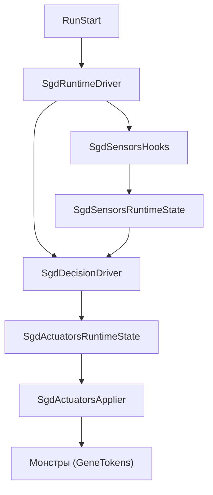

## Архитектура SGD DDA

Алгоритм SGD DDA реализован как отдельный модуль `SgdEngine/` и следует схеме:

**Sensors → Decision → Actuators → Мир RoR2**

При этом выбор активного алгоритма (генетический или SGD) контролируется через `DdaAlgorithmState.ActiveAlgorithm`.

### Основные подсистемы

- **Runtime‑драйвер**
  - `SgdEngine/SgdRuntimeDriver.cs`
  - Регистрируется на событие `Run.Start`.
  - Один раз за забег добавляет компонент `SgdRuntimeDriver` на объект `Run`.
  - Каждый кадр:
    - находит подходящее `CharacterBody` игрока;
    - обновляет виртуальную мощность игрока `SgdRuntimeState` на основе `SgdVirtualPowerEstimator`;
    - вызывает `SgdSensorsHooks.Tick(...)` для обновления сенсоров;
    - вызывает `SgdDecisionDriver.Tick(...)` (если активен SGD и сервер `NetworkServer.active`).

- **Sensors (сенсоры)**
  - Хуки: `SgdEngine/Sensors/SgdSensorsHooks.cs`
    - Подписывается на:
      - `On.RoR2.HealthComponent.TakeDamage`
      - `On.RoR2.CharacterBody.OnDestroy`
    - Ведёт отслеживаемое тело игрока и собирает:
      - входящий урон по игроку;
      - исходящий урон по монстрам;
      - смерти игрока и монстров (для TTK иDeathsPerWindow);
    - Обновляет оценку сенсоров через `SgdSensorsEstimator` и записывает её в `SgdSensorsRuntimeState`.
  - Состояние:
    - `SgdSensorsRuntimeState` содержит последний `SgdSensorsSample` и флаг наличия выборки.

- **Decision (модуль решения на SGD)**
  - Основной драйвер: `SgdEngine/Decision/SgdDecisionDriver.cs`
    - Обновляется через `Tick(playerBody, dt)` из `SgdRuntimeDriver`.
    - Проверяет:
      - что сервер активен (`NetworkServer.active`);
      - что выбран алгоритм `DdaAlgorithmType.Sgd`;
      - что игрок в бою (`!playerBody.outOfCombat`);
      - что есть актуальная выборка сенсоров (`SgdSensorsRuntimeState.HasSample`).
    - Накапливает «секунды боя» и дискретизирует адаптацию по шагам (`dueSteps`).
    - Для каждого шага выполняет `StepAllAxes(...)`, обновляя все включённые оси сложности.
  - Состояние решения:
    - `SgdDecisionRuntimeState` хранит:
      - значения параметров \( \theta \) по осям (HP, MoveSpeed, AttackSpeed, AttackDamage);
      - скорости (momentum) по каждой оси;
      - флаги включения адаптации по осям;
      - счётчики сделанных шагов и статистику.
  - Ограничения параметров:
    - `SgdEngine/SgdAxisLimitProvider.cs` определяет диапазоны `[floor, cap]` множителей для каждой оси.
    - `SgdDecisionDriver` использует эти пределы для перевода множителей в лог‑пространство и удержания \( \theta \) внутри безопасных границ.

- **Actuators (актуаторы)**
  - Хуки: `SgdEngine/Actuators/SgdActuatorsHooks.cs`
    - Подписывается на `On.RoR2.CharacterBody.Start`.
    - Для каждого нового `CharacterBody` монстра:
      - проверяет, что активен SGD и сервер (`NetworkServer.active`);
      - что это монстр (`teamIndex == TeamIndex.Monster`) и есть `inventory`;
      - применяет текущие множители:
        - через `SgdGeneStatTokenApplier.ApplyMultiplier(...)` к `GeneStat.MaxHealth`, `MoveSpeed`, `AttackSpeed`, `AttackDamage`;
      - вызывает `self.RecalculateStats()` для пересчёта характеристик.
  - Состояние актуаторов:
    - `SgdActuatorsRuntimeState` хранит текущие множители по осям.
    - Используется как:
      - источник правды при применении к новым монстрам;
      - источник текущих значений для синхронизации с `SgdDecisionRuntimeState`.
  - Глобальное применение:
    - `SgdActuatorsApplier.ApplyToAllLivingMonsters()` обновляет уже живых монстров при изменении множителей.

### Поток данных

Ниже приведена упрощённая диаграмма потока данных между основными компонентами:

Ключевые моменты:

- Сенсоры обновляются каждый кадр (пока активен SGD или включён debug‑overlay).
- Решение на SGD делает дискретные шаги по «секундам боя», а не по каждому кадру.
- Актуаторы обновляют как новых, так и уже живых монстров при заметном изменении множителей.

### Взаимодействие с внешними системами

- **Типы RoR2**, используемые в `SgdEngine/`:
  - `Run` — жизненный цикл забега (`Run.Start`).
  - `CharacterBody` — тела игрока и монстров, источник статистики и точка применения множителей.
  - `HealthComponent` — источник событий урона.
  - `TeamIndex` — различение команд (игроки, монстры и т.д.).
  - `RunArtifactManager` — управление артефактами (см. описание в `RULE.md`).
  - `NetworkServer` — гарантирует, что адаптация выполняется только на стороне сервера.

- **Связь с GeneticEngine**:
  - SGD DDA **не модифицирует** код в `GeneticEngine/`.
  - Общая точка пересечения — использование тех же `GeneStat` и `GeneTokens` через `SgdGeneStatTokenApplier`.
  - Это обеспечивает совместимость и независимое развитие двух алгоритмов DDA.

